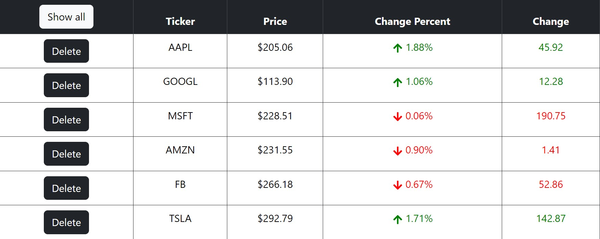

<h1 align="center"> Price Tickers Streaming App </h1>

<p align="center">

</p>

This web application allows users to view and manage real-time stock price tickers. It utilizes web sockets for live updates and provides features like stopping and deleting tickers.

## Features

- **Real-time Ticker Updates:** See live updates for stock price tickers.
- **Delete Tickers:** Permanently remove tickers from the list.
- **Show All Tickers:** Display all tickers, including those previously stopped or deleted.
- **Responsive Design:** The app is designed to work seamlessly on various devices.

## Testing 

- **TickersSlice Reducer Test Suite:** Testing the reducer actions.
- **PriceTicker Component Test Suite:** Rendering Component, Redux Store Setup, Element Existence Checks, Numeric Value,Delete Button Checks.

## Technologies Used

- **Frontend:**
  - React (with hooks)
  - Redux (Redux-Thunk)
  - Bootstrap
  - React Testing

- **Backend:**
  - Node.js
  - Express
  - Socket.io

## How to run this application
1. Clone or fork this repository
2. Run the local server:
 - ```cd server```
 - ```npm install``` or ```yarn install```
 - ```npm run start``` or ```yarn start```
3. Run the client:
 - ```cd client```
 - ```npm install``` or ```yarn install```
 - ```npm run start``` or ```yarn start```

